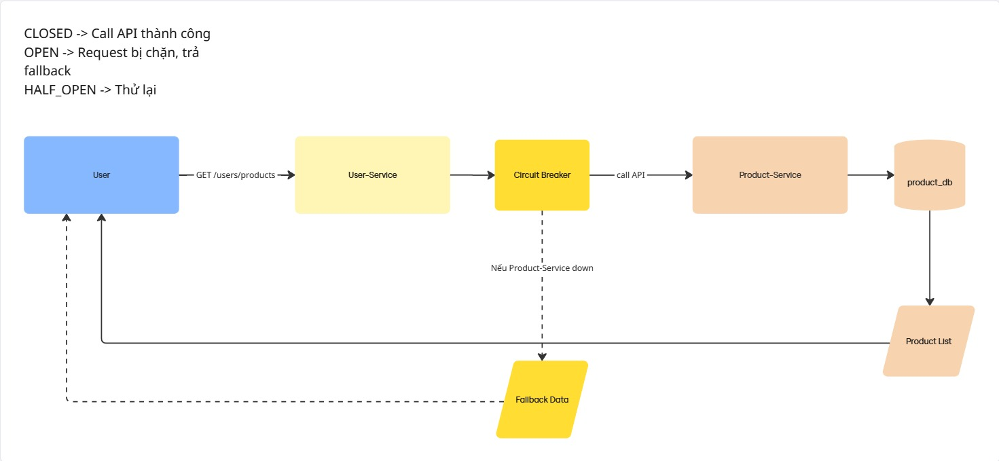

# 🛠️ Circuit Breaker Demo (Spring Boot + Resilience4j)

## 📌 Giới thiệu
Dự án này minh họa cách áp dụng **Circuit Breaker Pattern** trong kiến trúc microservices bằng **Spring Boot** và **Resilience4j**.  
Mục tiêu chính: bảo vệ hệ thống khi một service gặp sự cố, tránh lan truyền lỗi sang các service khác.

---

## 🏗️ System Architecture
Các phần chính:
- **User (Client)**: gửi request (Postman hoặc browser).
- **User-Service**:
  - Có Circuit Breaker khi gọi sang Product-Service.
  - Có DB riêng `user_db` (trong demo chưa sử dụng).
  - Nếu Product-Service down → trả về **Fallback Data**.
- **Product-Service**:
  - Có DB riêng `product_db`.
  - Quản lý danh sách sản phẩm.
  - Trả dữ liệu về cho User-Service.

---

## 🔄 Flow
1. User → gọi API `GET /users/products` (User-Service).  
2. User-Service → gọi REST API `GET /products` (Product-Service).  
3. Product-Service → query từ `product_db` → trả về danh sách sản phẩm.  
4. User-Service → trả kết quả cho User.  

👉 Nếu **Product-Service bị down**:  
- Circuit Breaker trong User-Service mở (**OPEN**).  
- User-Service không gọi Product-Service nữa.  
- Trả về **Fallback Data** (mock products).  

---

## 🖼️ Architecture Diagram


---

## ⚙️ Cấu hình Circuit Breaker
Trong `application.yml` của User-Service:

```yaml
resilience4j:
  circuitbreaker:
    instances:
      userService:
        register-health-indicator: true
        failure-rate-threshold: 50
        minimum-number-of-calls: 2
        wait-duration-in-open-state: 5s
        permitted-number-of-calls-in-half-open-state: 2
        sliding-window-size: 5
        sliding-window-type: COUNT_BASED
```

---

## ▶️ Cách chạy demo

### 1. Chuẩn bị Database
Tạo 2 database trong MySQL:

```sql
CREATE DATABASE product_db;
CREATE DATABASE user_db;
```

### 2. Chạy Product-Service
```bash
cd product-service
mvn spring-boot:run
```

### 3. Chạy User-Service
```bash
cd user-service
mvn spring-boot:run
```

### 4. Test
- Khi cả 2 service chạy:  
  `GET http://localhost:9292/users/products` → trả về dữ liệu từ product-service.  

- Khi **tắt product-service**:  
  `GET http://localhost:9292/users/products` → trả về mock fallback data từ user-service.  

- Sau vài giây, bật lại product-service → Circuit Breaker tự động chuyển sang **HALF_OPEN → CLOSED** nếu service hồi phục.  

---

## 📊 Theo dõi trạng thái Circuit Breaker
Sử dụng Actuator:  
- [http://localhost:9292/actuator/health](http://localhost:9292/actuator/health)  

---

## 📚 Công nghệ sử dụng
- Spring Boot 3  
- Resilience4j (Circuit Breaker)  
- Spring Data JPA  
- MySQL  
- Spring Boot Actuator  
